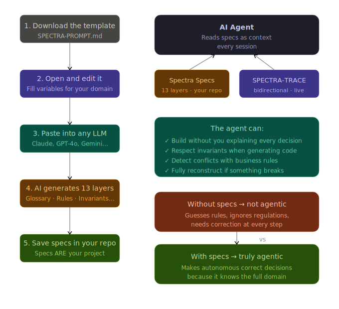

# SPECTRA

> **S**ource · **P**roduct · **E**xhaustive · **C**ontractual · **T**ruth · **R**econstructable · **A**gentic

**The specification framework designed to be consumed by AI, not humans.**

[](LICENSE)
[](https://github.com/GuiMiran/spectra/releases)

[🇪🇸 Versión en español](README.es.md)

---

## The problem

You give a task to an AI agent. You explain what you want. It builds something. But it guesses the business rules, ignores regulations, invents the exceptions. Ten messages later you're correcting it at every step.

This is not an AI problem. It's a context problem.

**AI doesn't fail because it's incapable. It fails because it doesn't know what you know.**

---

## The solution

Spectra is a framework for writing specifications that an AI agent can consume directly — without ambiguity, without additional context, without you correcting it at every step.

It's not technical documentation. Not a README. Not code comments.

It's the **domain source of truth**: business rules, invariants, contracts, regulations, decisions — all structured in 13 layers designed for an agent to operate autonomously.

```
You define the domain  →  Spectra structures the specs  →  AI builds, maintains and evolves the system
```

---

## How it works



---

## What makes Spectra different

| | Traditional docs | OpenSpec | GitHub Spec Kit | **Spectra** |
|---|---|---|---|---|
| **Audience** | Humans | Coding agents | Coding agents | Domain agents |
| **Describes** | How it works | How code evolves | How to build features | What the system IS |
| **Legal regulations** | Rarely | ❌ | ❌ | ✅ Required |
| **Boolean invariants** | ❌ | ❌ | ❌ | ✅ |
| **Full reconstruction** | ❌ | ❌ | ❌ | ✅ |
| **Bidirectional traceability** | ❌ | ❌ | ❌ | ✅ SPECTRA-TRACE |
| **Layer** | On top of code | On top of code | On top of code | **Before code** |

**Spectra doesn't compete with OpenSpec or GitHub Spec Kit — they are different layers. Spectra goes first.**

```
Spectra (domain)  →  OpenSpec / GitHub Spec Kit (construction)  →  Your code
```

---

## The 13 layers

```
Static layers — define the domain
──────────────────────────────────────────────────────────────
00 · Vision & Context         ← what it is and who it's for
01 · Domain Glossary          ← the canonical language
02 · User Stories             ← what users need
03 · Business Rules           ← every rule with regulatory source
04 · Invariants               ← always-true conditions
05 · Operation Contracts      ← pre/postconditions per operation
06 · Decision Policies        ← IF/THEN trees
07 · Domain Events            ← facts and their consequences
08 · Agents                   ← autonomous actors
09 · Skills                   ← atomic invocable capabilities
10 · Workflows                ← agent and skill orchestration
11 · Acceptance Criteria      ← tests in natural language
──────────────────────────────────────────────────────────────
Live layer — updated by the agent every iteration
──────────────────────────────────────────────────────────────
12 · SPECTRA-TRACE            ← bidirectional traceability matrix
```

Every layer has an exact format. Every element has a unique ID. Everything is cross-referenced.

**SPECTRA-TRACE** is the key innovation: a bidirectional matrix the agent updates automatically at the end of every iteration.

- **Spec → Code** (forward): detects **functional gaps** — things the business needs that don't exist yet
- **Code → Spec** (reverse): detects **technical gaps** — orphaned code with no business rule justifying it

---

## Quickstart

### 1. Fill the universal prompt

Open `SPECTRA-PROMPT.md` and fill the variables: project name, sector, regulations, users, modules, known rules, regulatory constraints.

### 2. Paste into any LLM

Claude, GPT-4o, Gemini — any frontier model generates the 13 layers from the filled prompt.

### 3. Save specs in your repo

The specs live alongside your code. They are the source of truth — not documentation about the system, but the system itself.

### 4. Agent builds with specs as context

With specs in context, the agent builds, respects invariants, detects conflicts with business rules, and can fully reconstruct the system if something breaks.

---

## Real-world example: GastroFlow

The repo includes **GastroFlow** — a complete restaurant management app built 100% with Spectra:

- Full 13-layer specs
- React 19 + Vite 8 + Tailwind v4
- Double-entry accounting logic
- Invoice generation with Spanish tax regulations
- **Fully reconstructable from specs alone**

> [See GastroFlow →](./examples/gastroflow/)

**The reconstruction test**: give the specs to an agent in an empty context. Ask it to build GastroFlow from scratch. It should produce an identical app without any additional explanation. That's Spectra working.

---

## Repo structure

```
spectra/
├── README.md                     ← you are here
├── README.es.md                  ← Spanish version
├── MANIFESTO.md                  ← the 7 principles of SPECTRA
├── SPECTRA-PROMPT.md             ← universal prompt (fill and use)
├── GUIA-VARIABLES.md             ← variable guide
├── docs/
│   └── flow.svg                  ← architecture diagram
├── layers/
│   └── 12-trace.md               ← SPECTRA-TRACE · bidirectional matrix
├── examples/
│   ├── gastroflow/               ← complete real-world example
│   └── EJEMPLO-RELLENADO-SAAS-GESTION.md
├── vs-openspec.md                ← Spectra vs OpenSpec + GitHub Spec Kit
└── vs-frameworks.md              ← Spectra vs RTM, BDD, ADR, Backstage, SBOM, OTel
```

---

## Framework comparison

| Framework | Layer | Business domain | Regulations | Invariants | Gap detection | AI-native |
|---|---|---|---|---|---|---|
| **Spectra** | Domain | ✅ | ✅ | ✅ | ✅ Bidirectional | ✅ |
| OpenSpec | Construction | ❌ | ❌ | ❌ | ❌ | Partial |
| GitHub Spec Kit | Construction | ❌ | ❌ | ❌ | ❌ | Partial |
| BDD/Cucumber | Behaviour | Partial | ❌ | ❌ | ❌ | ❌ |
| RTM/DOORS | Traceability | ❌ | Reference | ❌ | Partial | ❌ |
| ADR/MADR | Decisions | Partial | ❌ | ❌ | ❌ | ❌ |

Full breakdown → [vs-frameworks.md](vs-frameworks.md)

---

## License

MIT — use it, adapt it, improve it.

---

*Spectra was built with AI, describes how to build with AI, and is the manual AI uses to maintain itself. That recursion is not accidental — it's the point.*
