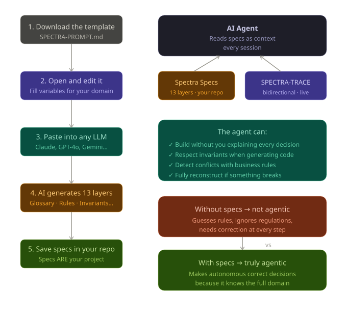

# SPECTRA

> **S**ource · **P**roduct · **E**xhaustive · **C**ontractual · **T**ruth · **R**econstructable · **A**gentic

**The specification framework designed to be consumed by AI, not humans.**

[](LICENSE)
[](https://github.com/GuiMiran/spectra/releases)

[🇪🇸 Versión en español](README.es.md)

---

## The problem

You give a task to an AI agent. You explain what you want. It builds something. But it guesses the business rules, ignores regulations, invents the exceptions. Ten messages later you're correcting it at every step.

This is not an AI problem. It's a context problem.

**AI doesn't fail because it's incapable. It fails because it doesn't know what you know.**

---

## The solution

Spectra is a framework for writing domain specifications that an AI agent can consume directly. Its layers, identifiers and contracts aim to reduce hidden assumptions and make gaps reviewable.

It's not technical documentation. Not a README. Not code comments.

It's a proposed **domain source of truth**: business rules, invariants, contracts, regulations and decisions structured in 13 layers for consistent agent context.

```
You define the domain  →  Spectra structures the specs  →  AI builds, maintains and evolves the system
```

---

## Installation

### Via npm (recommended)

```bash
npm install -g @guimiran/spectra
spectra init
```

### Via Git

```bash
git clone https://github.com/GuiMiran/spectra.git
cd your-project
node ../spectra/bin/spectra.js init
```

---

## How it works



---

## What makes Spectra different

| | Traditional docs | OpenSpec | GitHub Spec Kit | **Spectra** |
|---|---|---|---|---|
| **Audience** | Humans | Coding agents | Coding agents | Domain agents |
| **Describes** | How it works | How code evolves | How to build features | What the system IS |
| **Legal regulations** | Rarely | ❌ | ❌ | ✅ Required |
| **Boolean invariants** | ❌ | ❌ | ❌ | ✅ |
| **Explicit reconstruction test** | ❌ | ❌ | ❌ | ✅ |
| **Bidirectional traceability** | ❌ | ❌ | ❌ | ✅ SPECTRA-TRACE |
| **Layer** | On top of code | On top of code | On top of code | **Before code** |

**Spectra doesn't compete with OpenSpec or GitHub Spec Kit — they are different layers. Spectra goes first.**

```
Spectra (domain)  →  OpenSpec / GitHub Spec Kit (construction)  →  Your code
```

---

## The 13 layers

```
Static layers — define the domain
──────────────────────────────────────────────────────────────
00 · Vision & Context         ← what it is and who it's for
01 · Domain Glossary          ← the canonical language
02 · User Stories             ← what users need
03 · Business Rules           ← every rule with regulatory source
04 · Invariants               ← always-true conditions
05 · Operation Contracts      ← pre/postconditions per operation
06 · Decision Policies        ← IF/THEN trees
07 · Domain Events            ← facts and their consequences
08 · Agents                   ← autonomous actors
09 · Skills                   ← atomic invocable capabilities
10 · Workflows                ← agent and skill orchestration
11 · Acceptance Criteria      ← tests in natural language
──────────────────────────────────────────────────────────────
Live layer — updated by the agent every iteration
──────────────────────────────────────────────────────────────
12 · SPECTRA-TRACE            ← bidirectional traceability matrix
```

Every layer has an exact format. Every element has a unique ID. Everything is cross-referenced.

**SPECTRA-TRACE** is the key innovation: a bidirectional matrix the agent updates automatically at the end of every iteration.

- **Spec → evidence** (forward): reports whether a requirement has both a declared artifact link and an acceptance-criterion link
- **Code → Spec** (reverse): reports `@spectra` tags that do not resolve to a specification ID

These are static traceability checks. An `@spectra` tag is a declaration, not proof that behaviour is correct; independent tests are still required.

---

## Using with OpenSpec or GitHub Spec Kit

Spectra **complements** OpenSpec and GitHub Spec Kit — they work on different layers:

```
Spectra (domain)  →  OpenSpec / GitHub Spec Kit (construction)  →  Your code
```

1. **First**: Use Spectra to define your domain (business rules, invariants, regulations)
2. **Then**: Use OpenSpec or Spec Kit to implement features with that domain as context
3. **Result**: Agents receive explicit domain constraints and their output can be evaluated against them

See detailed comparison in [vs-openspec.md](vs-openspec.md).

---

### 1. Fill the universal prompt

Open `SPECTRA-PROMPT.md` and fill the variables: project name, sector, regulations, users, modules, known rules, regulatory constraints.

### 2. LLM generates the 13 layers

Send the filled prompt to an LLM (Claude, GPT-4, Gemini). It generates structured specs — not code, but machine-readable business knowledge.

### 3. Agent builds with specs as context

With specs in context, the agent can:
- Receive the same explicit domain constraints in each session
- Reference invariants and business rules while generating code
- Expose missing trace or acceptance links for review
- Produce a candidate that can be evaluated with an independent oracle

### 4. You evolve specs, AI evolves the system

When a business rule changes, update the spec first, identify its linked elements and verify the resulting code change independently.

---

## Making Spectra Visible to Agents

### In VS Code / Copilot

Add to `.instructions.md` in your project:

```markdown
## Spectra Framework

This project uses Spectra for domain specification:
- Read specs from .spectra/ before making changes
- Respect invariants in 04-invariants.md
- Apply business rules from 03-business-rules.md
- Update 12-trace.md at the end of each iteration
```

### As Direct Context

Simply include specs in your project:
```
my-project/
├── .spectra/           ← Agent reads automatically
│   ├── 00-vision.md
│   ├── 01-glossary.md
│   └── ...
└── src/
```

### Via MCP (Model Context Protocol)

An MCP server is a future integration. No supported Spectra MCP package is published by this repository today; do not add an MCP configuration until an implementation and installation instructions are released.

See [complete visibility guide](docs/VISIBILIDAD.md).

---

### 2. Paste into any LLM

Claude, GPT-4o, Gemini — any frontier model generates the 13 layers from the filled prompt.

### 3. Save specs in your repo

The specs live alongside your code. They are the source of truth — not documentation about the system, but the system itself.

### 4. Agent builds with specs as context

With specs in context, the agent builds, respects invariants, detects conflicts with business rules, and can fully reconstruct the system if something breaks.

---

## Examples

- [GastroFlow](./examples/gastroflow/) is a legacy, pre-standard showcase. It predates the current 13-layer convention and is intentionally excluded from the validator.

A current-format, synthetic fixture is required before making repeatable reconstruction claims.

The reconstruction hypothesis should be tested by giving the same frozen specification to independent agents and measuring behavioural equivalence with evaluator-owned tests. Structural identity is not required and is not claimed.

---

## Repo structure

```
spectra/
├── README.md                     ← you are here
├── README.es.md                  ← Spanish version
├── MANIFESTO.md                  ← the 7 principles of SPECTRA
├── SPECTRA-PROMPT.md             ← universal prompt (fill and use)
├── GUIA-VARIABLES.md             ← variable guide
├── docs/
│   └── flow.svg                  ← architecture diagram
├── layers/
│   └── 12-trace.md               ← SPECTRA-TRACE · bidirectional matrix
├── examples/
│   ├── gastroflow/               ← complete real-world example
│   └── EJEMPLO-RELLENADO-SAAS-GESTION.md
├── vs-openspec.md                ← Spectra vs OpenSpec + GitHub Spec Kit
└── vs-frameworks.md              ← Spectra vs RTM, BDD, ADR, Backstage, SBOM, OTel
```

---

## Framework comparison

| Framework | Layer | Business domain | Regulations | Invariants | Gap detection | AI-native |
|---|---|---|---|---|---|---|
| **Spectra** | Domain | ✅ | ✅ | ✅ | ✅ Bidirectional | ✅ |
| OpenSpec | Construction | ❌ | ❌ | ❌ | ❌ | Partial |
| GitHub Spec Kit | Construction | ❌ | ❌ | ❌ | ❌ | Partial |
| BDD/Cucumber | Behaviour | Partial | ❌ | ❌ | ❌ | ❌ |
| RTM/DOORS | Traceability | ❌ | Reference | ❌ | Partial | ❌ |
| ADR/MADR | Decisions | Partial | ❌ | ❌ | ❌ | ❌ |

Full breakdown → [vs-frameworks.md](vs-frameworks.md)

---

## License

CC BY-NC-ND 4.0 — read it, use it, credit it. No derivatives. No commercial use without permission.

Copyright © 2025 Guido Miranda Mercado. All rights reserved.

---

*Spectra was built with AI, describes how to build with AI, and is the manual AI uses to maintain itself. That recursion is not accidental — it's the point.*
